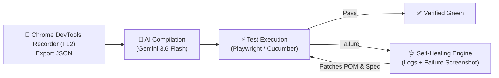
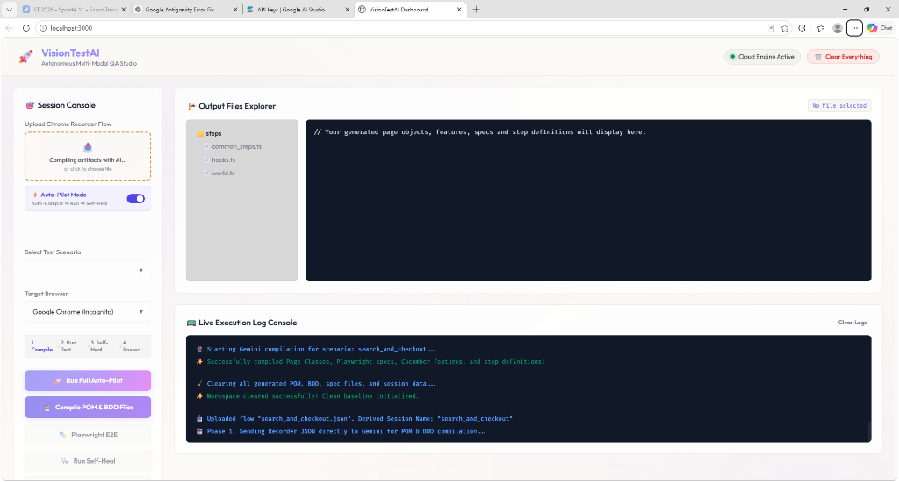
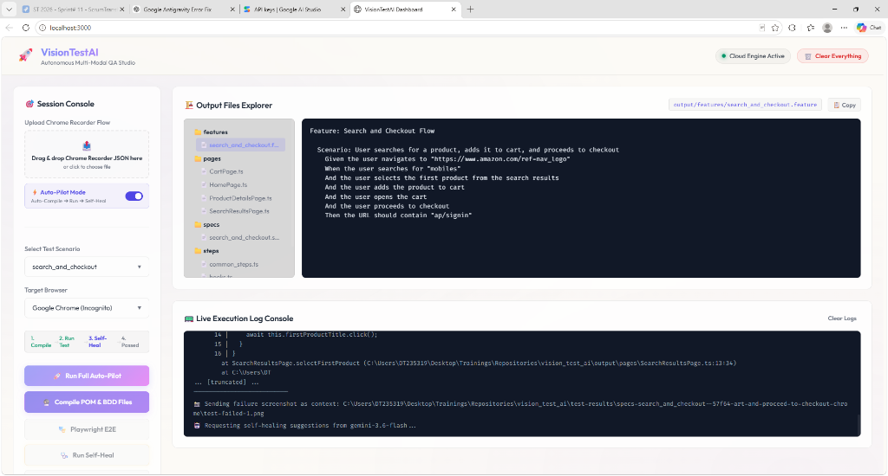

# 🚀 VisionTestAI

An autonomous, multi-modal AI-driven QA developer studio that translates user interaction flows and Chrome DevTools recordings into production-ready Page Object Model (POM) classes, Playwright test specs, and Cucumber BDD suites with built-in visual self-healing.

[](https://vision-test-ai.onrender.com)
[](https://ai.google.dev/)
[](https://playwright.dev/)

🔗 **Live Demo URL**: [https://vision-test-ai.onrender.com](https://vision-test-ai.onrender.com)

---

## 📌 Problem Statement

Writing end-to-end integration and QA tests is often time-consuming, repetitive, and brittle:
* **Fragile Locators**: Tests break constantly when CSS classes, dynamic IDs, or DOM structures change.
* **Redundant Boilerplate**: Writing Page Object Model (POM) classes and Cucumber step definitions manually for dozens of user journeys takes extensive engineering effort.
* **Ambiguous Step Errors**: As BDD suites grow, duplicate step definitions cause Cucumber collisions.
* **Manual Debugging**: Fixing failing tests requires manually reproducing the failure, inspecting the DOM, updating the selector, and re-running the test.

---

## 💡 Solution: The VisionTestAI Pipeline



1. **Direct Recorder Ingestion**: Upload Chrome DevTools Recorder `.json` files directly through the Web Dashboard or CLI.
2. **AI-Powered Shared Page Object Model (POM)**: **Gemini 3.6 Flash** analyzes the user journey and generates modular page object classes under `output/pages/`. Shared pages across scenarios are automatically reused and extended.
3. **Cucumber BDD with Deduplicated Step Definitions**: Generates Gherkin feature files (`output/features/`) and maps steps to page objects (`output/steps/`). Universal steps live in a shared `common_steps.ts` to guarantee **zero ambiguous step errors**.
4. **Autonomous Visual Self-Healing**: If a test fails, the runner captures the console stack trace and visual failure screenshot, feeds both to Gemini to diagnose locator or timing changes, applies the patch, and re-runs until green.
5. **1-Click Auto-Pilot**: Upload a flow and let the studio automatically compile, execute, and self-heal in a single seamless flow.

---

## 🎥 Step-by-Step Guide: Capturing, Compiling & Running Tests

### 1️⃣ Step 1: Capture Recording in Chrome / Edge (`F12` DevTools)

1. Open **Google Chrome** (or **Microsoft Edge**).
2. Press **`F12`** (or `Ctrl + Shift + I` / `Cmd + Option + I` on Mac) to open **DevTools**.
3. Open the **Recorder** tab:
   - If the Recorder tab is not visible in the top tab bar, click the **`+`** (More tabs) icon or the three dots menu `⋮` ➔ **More tools** ➔ **Recorder**.
4. Click **`Create a new recording`**:
   - Enter a **Recording name** (e.g. `search_and_checkout` or `login_flow`).
   - *(Optional)* Enter the starting URL.
5. Click **`Start recording`** (🔴):
   - Perform your test actions in the browser (search, click, type, fill forms, navigate).
   - DevTools Recorder automatically logs all user events, target selectors, and navigations.
6. Click **`End recording`** when your scenario is complete.
7. Click the **Export icon (⬇️)** in the top action bar of the Recorder panel and select **`Export as a JSON file`**:
   - Saves your recording as a `.json` file (e.g., `search_and_checkout.json`).

---

### 2️⃣ Step 2: Ingest & Generate Artifacts with AI

You can generate test artifacts using either the **Web Dashboard Studio** or the **CLI**:

#### Option A: Via Web Dashboard Studio
1. Launch the studio:
   ```bash
   npm run dashboard
   ```
2. Open `http://localhost:3000` (or the Live Demo: [https://vision-test-ai.onrender.com](https://vision-test-ai.onrender.com)).
3. Drag & drop (or click to browse) your exported `.json` file in the **Upload Chrome Recorder Flow** zone.
4. **Gemini 3.6 Flash** automatically parses the flow and generates:
   - **Modular Page Objects**: `output/pages/*.ts` (reusing existing page classes if already defined).
   - **Playwright Test Spec**: `output/specs/*.spec.ts`
   - **Cucumber BDD Feature**: `output/features/*.feature`
   - **Cucumber Step Definitions**: `output/steps/*_steps.ts`
5. The generated artifacts instantly appear in the **Output Files Explorer** tree for live inspection.

#### Option B: Via Command Line / CI Auto-Pilot
```bash
npm run pipeline -- path/to/search_and_checkout.json --browser=chrome
```

---

### 3️⃣ Step 3: Execute Tests & Autonomous Self-Healing

#### Running via Web Studio
* If **Auto-Pilot Mode** is toggled **ON** *(default)*, execution kicks off automatically right after upload!
* Or click any of the dedicated action buttons:
  - **`🚀 Run Full Auto-Pilot`**: Runs end-to-end compile, execute, and self-healing for the selected scenario.
  - **`🎭 Playwright E2E`**: Executes the Playwright test suite against headed Chrome/Edge.
  - **`🩺 Run Self-Heal`**: Runs Playwright with active visual failure diagnosis and POM repair.
  - **`🥒 Cucumber BDD`**: Executes the Gherkin feature suite with Cucumber-JS.

#### Running via Terminal / CI
* **Playwright E2E**:
  ```bash
  npx playwright test output/specs/search_and_checkout.spec.ts --project=chrome --headed
  ```
* **Self-Healing Run**:
  ```bash
  npm run heal -- output/specs/search_and_checkout.spec.ts --project=chrome
  ```
* **Cucumber BDD**:
  ```bash
  npm run bdd
  ```
* **Parallel Cross-Browser BDD (Chrome + Edge)**:
  ```bash
  npm run bdd:parallel
  ```

---

### 4️⃣ Step 4: How Autonomous Self-Healing Operates

When a test step fails during execution (e.g. broken locator, shifted element, or timeout):
1. Playwright captures the exact console stack trace and a screenshot of the browser at the moment of failure (`test-results/*.png`).
2. The self-healing engine transmits the screenshot, error log, and failing POM class to **Gemini 3.6 Flash**.
3. Gemini identifies the root cause and updates the locator/wait logic in `output/pages/[PageName].ts`.
4. The test automatically re-executes against the browser until green (up to 3 attempts), with live progress updates in the log console!

---

## 📸 Studio Screenshots

### 1. Ingesting Chrome Recorder Flows & AI Compilation


### 2. Output Files Explorer & Autonomous Self-Healing Execution


---

## 🖥️ Web Dashboard Studio (`http://localhost:3000`)

```
┌───────────────────────────────────────────────────────────────────────────────────────────┐
│ 🚀 VisionTestAI Studio                                🟢 Cloud Engine Active  [🗑️ Clear] │
├───────────────────────────────┬───────────────────────────────────────────────────────────┤
│ 🎯 Session Console            │ 🏗️ Output Files Explorer              output/pages/Home.ts│
│ ┌───────────────────────────┐ │ ┌───────────────┬───────────────────────────────────────┐ │
│ │ 📤 Upload Recorder JSON   │ │ │ 📁 features   │ export class HomePage {               │ │
│ │   Drag & drop .json here  │ │ │ 📁 pages      │   constructor(private page: Page) {}  │ │
│ └───────────────────────────┘ │ │   📄 HomePage │   async navigate() {                  │ │
│ ⚡ Auto-Pilot Mode    [ ON ] │ │ 📁 specs      │     await this.page.goto('...');      │ │
│ ───────────────────────────── │ │ 📁 steps      │   }                                   │ │
│ Target Browser: [ Chrome ▼ ]  │ │   📄 common   │ }                                     │ │
│ ┌───────────────────────────┐ │ └───────────────┴───────────────────────────────────────┘ │
│ │ 1.Compile ➔ 2.Run ➔ 3.Heal│ ├───────────────────────────────────────────────────────────┤
│ └───────────────────────────┘ │ 📟 Live Execution Log Console                             │
│ 🚀 Run Full Auto-Pilot        │ [SYSTEM] Ready for execution.                             │
│ 🔮 Compile POM & BDD Files    │ 🤖 Phase 1: Sending Recorder JSON to Gemini 3.6 Flash...  │
│ 🎭 Playwright  🩺 Self-Heal   │ ⚡ Executing Playwright E2E (Headed Chrome)...             │
│ 🥒 Cucumber BDD               │ ✨ Test passed successfully!                              │
└───────────────────────────────┴───────────────────────────────────────────────────────────┘
```

### 🧭 Studio UI Components

#### 1. Header Bar
* **Status Badge**: Displays backend engine status (`Cloud Engine Active`).
* **`🗑️ Clear Everything` Button**: Prompts for confirmation and resets the studio (wipes previous outputs, cleans session logs, resets file tree, and re-initializes clean Cucumber baseline steps).

#### 2. Session Console (Left Panel)
* **Upload Chrome Recorder Flow**: Drag & drop or click to upload any Chrome DevTools Recorder `.json` export.
* **⚡ Auto-Pilot Mode Toggle** *(Default: ON)*: When active, uploading a `.json` file automatically chains **Upload ➔ Compile Artifacts ➔ Run Test ➔ Auto-Heal on Failure**.
* **Select Test Scenario**: Dropdown to select and inspect any previously compiled scenario.
* **Target Browser**: Switch execution target between **Google Chrome (Incognito)** and **Microsoft Edge (InPrivate)**.
* **Visual Pipeline Stepper**: Shows live progress transitions:
  `1. Compile` ➔ `2. Run Test` ➔ `3. Self-Heal` ➔ `4. Passed`
* **Action Buttons**:
  * **`🚀 Run Full Auto-Pilot`**: Runs end-to-end compilation, execution, and self-healing for the selected scenario.
  * **`🔮 Compile POM & BDD Files`**: Compiles artifacts with Gemini without executing tests.
  * **`🎭 Playwright E2E`**: Executes the Playwright TypeScript test suite.
  * **`🩺 Run Self-Heal`**: Runs Playwright with active visual failure diagnosis and self-healing.
  * **`🥒 Cucumber BDD`**: Executes the Gherkin feature with Cucumber-JS.

#### 3. Output Files Explorer (Top Right)
* **Sidebar Tree**: Browse all generated `output/features/`, `output/pages/`, `output/specs/`, and `output/steps/`.
* **Syntax-Highlighted Code Viewer**: Click any file to inspect code.
* **`📋 Copy` Button**: Copy file contents directly to clipboard.

#### 4. Live Execution Log Console (Bottom Right)
* **Real-time SSE Log Stream**: Live terminal output streamed directly from test runners and Gemini compilation cycles.
* **Clear Logs**: Clears the console log window.

---

## 🏛️ Core Architecture Highlights

### 1. Shared Page Object Model (POM) Deduplication
* When multiple scenarios share common screens (e.g. `LoginPage`, `HomePage`, `CartPage`), the generator **reuses and extends** the existing page class under `output/pages/`.
* It never creates redundant duplicate files like `LoginPage_1.ts` or `LoginPage_2.ts`.

### 2. Single Step Definition Rule (Cucumber BDD)
* Universal steps (navigation, waits, generic clicks, title/URL assertions) are stored in [`output/steps/common_steps.ts`](file:///output/steps/common_steps.ts).
* Feature files reuse these shared steps directly. Scenario step files only define new, unique actions.
* **Guarantees zero Cucumber ambiguous step definition collisions across all features.**

---

## 💰 Token Consumption Guide

| Activity | Uses AI Tokens? | Description |
| :--- | :---: | :--- |
| **Artifact Compilation** | **YES ⚡** | Sent to Gemini 3.6 Flash to synthesize POM classes, specs, features, and steps. |
| **Test Execution** (Playwright / Cucumber) | **NO 🟢 (0 Tokens)** | Runs 100% locally on your machine via Node.js and Chromium. |
| **Autonomous Self-Healing** | **YES ⚡** | Only triggered **when a test fails** (sends screenshot + error log to repair code). |
| **Dashboard Browsing / Code Inspection / Reset** | **NO 🟢 (0 Tokens)** | Purely local file system and UI operations. |

---

## 🛠️ Tech Stack & Prerequisites

* **Runtime**: Node.js v20+ & TypeScript
* **Test Runner**: [Playwright Test](https://playwright.dev/) & [Cucumber.js](https://cucumber.io/)
* **AI Model**: [Google Gemini 3.6 Flash](https://ai.google.dev/) via `@google/genai` SDK
* **Server & UI**: Express 5, Server-Sent Events (SSE), Vanilla CSS

---

## 🚀 Quick Start Guide

### 1. Clone & Install
```bash
git clone <repository_url>
cd vision_test_ai
npm install
```

### 2. Configure Gemini API Key
Create a `.env` file in the root folder:
```env
GEMINI_API_KEY=AIzaSyYourActualKeyHere
GEMINI_MODEL=gemini-3.6-flash
```
*(Get a key from [Google AI Studio](https://aistudio.google.com/app/apikey))*.

### 3. Verify Connection
```bash
npx ts-node src/link_test.ts
```

### 4. Launch Dashboard
```bash
npm run dashboard
```
Open `http://localhost:3000` in your browser.
