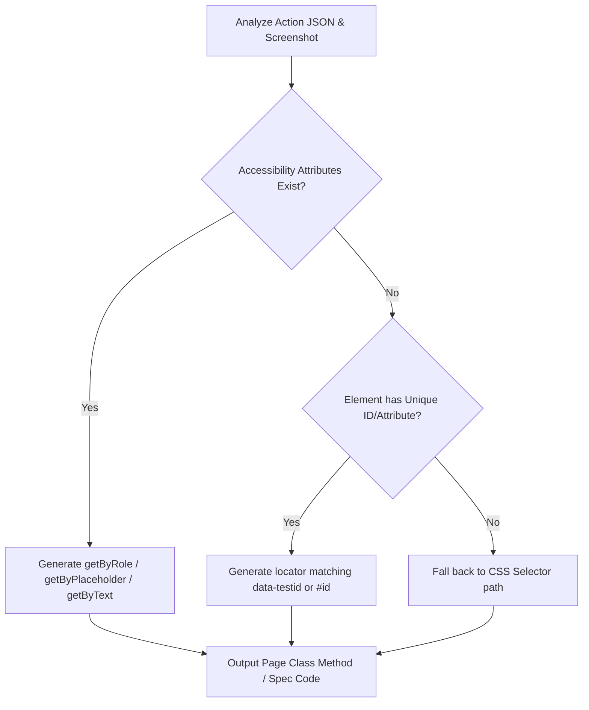

# SOP: Locator Capture & Translation Strategy

This document details the architectural specifications and standard operating procedures (SOP) for how element locators are captured during browser recording and translated into Playwright test scripts.

---

## 1. Browser-Side Metadata Harvesting

Element locators are captured using browser-side event listeners injected via `page.addInitScript()` in [`src/record.ts`](file:///c:/Users/DT235319/Desktop/Trainings/Repositories/vision_test_ai/src/record.ts). 

Rather than relying purely on CSS selectors, the injected script harvests semantic accessibility metadata from the `event.target` DOM element:

| Metadata Field | Extraction Mechanism | Target Playwright Locator |
| :--- | :--- | :--- |
| **Accessible Role** | Matches native element tags (e.g., `<button>` $\rightarrow$ `button`, `<a>` $\rightarrow$ `link`) and custom ARIA `role="..."` attributes. | `page.getByRole(role, { name: ... })` |
| **Text Content** | Extracts `textContent` / `innerText`. | `page.getByRole(role, { name: text })` or `page.getByText(text)` |
| **Label Linkages** | Scans for associated `<label>` text matching input `id` or wrapping the element. | `page.getByLabel(labelText)` |
| **Placeholder** | Reads the element's `placeholder` attribute. | `page.getByPlaceholder(placeholderText)` |
| **Aria Label** | Reads the element's `aria-label` attribute. | `page.getByRole(role, { name: ariaLabel })` |
| **CSS Selector** | Walks up the DOM tree recursively combining element tags, IDs, class names, and `:nth-of-type` structure as a fallback. | `page.locator(selector)` |

---

## 2. Playwright-to-Node Bridge API

1. **Exposing Bridge**:
   The Node process exposes a binding to the page context via:
   ```typescript
   await page.exposeFunction('onUserAction', (actionData) => { ... });
   ```
2. **Event Dispatch**:
   The injected DOM listeners capture events (`click`, `change`, `keydown`) and dispatch the harvested metadata immediately:
   ```javascript
   window.onUserAction({ action: 'click', tagName, role, text, selector, ... });
   ```
3. **Execution Synchronization**:
   - The Node process receives the exposed function callback.
   - It triggers a 200ms delay to allow layout animations to settle.
   - It captures a 60% quality JPEG screenshot and appends the metadata step details to `data/actions.json`.

---

## 3. Playwright Spec Generation Strategy (Gemini 3.5 Flash)

During generation in [`src/generate.ts`](file:///c:/Users/DT235319/Desktop/Trainings/Repositories/vision_test_ai/src/generate.ts), Gemini compiles the JSON log and screenshots into test code following these priorities:



### Invariants:
* **Brittle Selectors Avoidance**: Brittle CSS paths (like `div > div > span`) must only be used as a final fallback.
* **Declarative Specs**: The main spec file `output/specs/generated_test.spec.ts` must call high-level page class methods, keeping the spec file declarative and readable.
